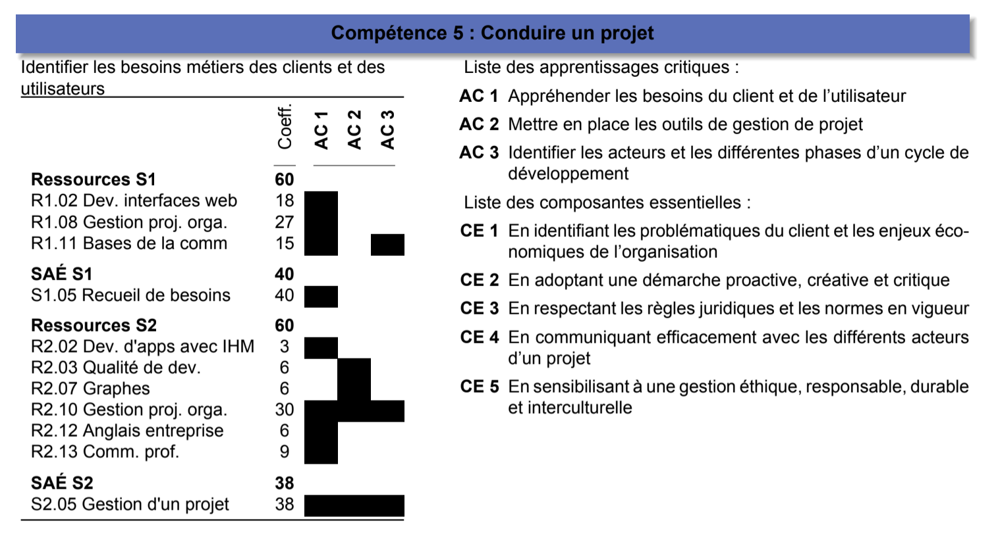

:num-comp: 5
:mytitle: Identifier les besoins métiers des clients et des utilisateurs
:year: 2021-2022
= Compétence {num-comp}: {mytitle}
:icons: font
include::definitions.adoc[]

== Programme national

:mywidth: 90

== Déclinaison {year} image:dpt-info.png["logo iut",width=10%,pdfwidth=10%]

