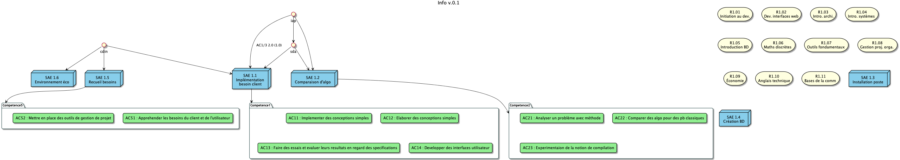

= BUT-PPN2021
:plantuml: https://plantuml.com/[PlantUML]
:repo: https://github.com/IUT-Blagnac/BUT-PPN2021/blob/main/

Tentative d'organisation des dépendances SAÉ / Compétences / etc. du BUT Informatique 

== Organisation

Le répertoire contient des descriptions des :

- Compétences (link:{repo}/competences.plantuml[competences.plantuml])
- Ressources (link:{repo}/ressources.plantuml[ressources.plantuml])
- SAÉ (link:{repo}/sae.plantuml[sae.plantuml])

Le fichier link:{repo}/config.plantuml[config.plantuml] contient les définitions communes (couleurs, styles etc.).

Le fichier link:{repo}/butgraph.plantuml[butgraph.plantuml] est un exemple complet :

[source,plantuml]
----
include::butgraph.plantuml[]
----

== Outils

=== Visualisation

Vous pouvez visualiser simplement les fichiers {plantuml}, en utilisant :

- un outil en ligne comme https://plantuml-editor.kkeisuke.com/
+
image::online.png[width=50%]
+
- le plugin pour votre editeur (eclipse, ou ici Visual Studio Code)
+

=== Génération des `.svg` ou `.png` ou autre

[source]
java -jar plantuml.jat butgraph.plantuml