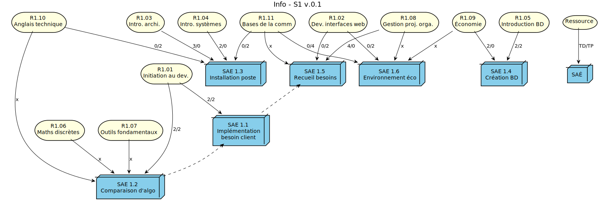

= BUT-PPN2021
:plantuml: https://plantuml.com/[PlantUML]
:repo: https://github.com/IUT-Blagnac/BUT-PPN2021/blob/main/
:imagesdir: images

Tentative d'organisation des dépendances SAÉ / Compétences / etc. du BUT Informatique 

== Planification S1

.Liens Ressources/SAÉ pour le S1 (source link:{repo}/buts1.plantuml[buts1.plantuml])

== Plannification S2

.Liens Ressources/SAÉ pour le S2 (source link:{repo}/buts2.plantuml[buts2.plantuml])
image::buts2.svg[]

.Exemple de lien entre SAÉ (ici les SAÉs correspondant à l'actuel Ptut S2 -- source link:{repo}/plannif-sae-s2.plantuml[plannif-sae-s2.plantuml])
image::sae-s2-exemple-plannif.svg[]

== Organisation

Le répertoire contient des descriptions des :

- Compétences (link:{repo}/competences.plantuml[competences.plantuml])
- Ressources (link:{repo}/ressources.plantuml[ressources.plantuml])
- SAÉ (link:{repo}/sae.plantuml[sae.plantuml])

Le fichier link:{repo}/config.plantuml[config.plantuml] contient les définitions communes (couleurs, styles etc.).

Le fichier link:{repo}/butgraph.plantuml[butgraph.plantuml] est un exemple complet :

[source,plantuml]
----
@startuml butgraph

!include config.plantuml
!include competences.plantuml
!include ressources.plantuml
!include sae.plantuml

'----------- SAÉs
sae11 --> Competence1
sae12 --> Competence2
sae15 --> Competence5

'----------- Graphe
title Info v.0.1

cdin --> sae16
cdin --> sae15
cdin --> sae11
iap --> sae11 : AC1/3 2.0 (1.0)
iap --> sae12
sda --> sae11 
sda --> sae12
iap --> sda

' Astuce cachée pour mettre la 16 à gauche de la 15
sae16 -[hidden]> sae15
@enduml
----

.Graphe complet

.Extrait pour la SAÉ 1.1

== Outils

=== Visualisation

Vous pouvez visualiser simplement les fichiers {plantuml}, en utilisant :

- un outil en ligne comme https://plantuml-editor.kkeisuke.com/
+

+
- le plugin pour votre editeur (eclipse, ou ici Visual Studio Code)
+
image::vs.png[width=50%]

=== Génération des `.svg` ou `.png` ou autre

Commande pour générer en local la version `.svg` du graphe :

[source]
java -jar plantuml.jar -tsvg butgraph.plantuml

[appendix]
== Vocabulaire BUT

Le vocabulaire du BUT étant nouveau, nous avons réalisé plusieurs diagrammes de classe des différents concepts.

=== Concepts de base

.Les concepts de base du BUT (source {repo}/vocabulaireBUT-base.plantuml[ici])

=== Les différents parcours

.Les parcours possibles du BUT informatique (source {repo}/vocabulaireBUT-parcours.plantuml[ici])

===  Notation et évaluation

.Les évaluations dans le BUT (source {repo}/vocabulaireBUT-notes.plantuml[ici])

=== Glossaire des acronymes

AC:: Apprentissage Critique
APC:: Apprentissage Par Compétence
BUT:: Bachelor Universitaire de Technologie
SAÉ:: Situation d'Apprentissage et d'Évaluation